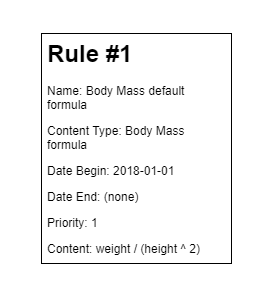
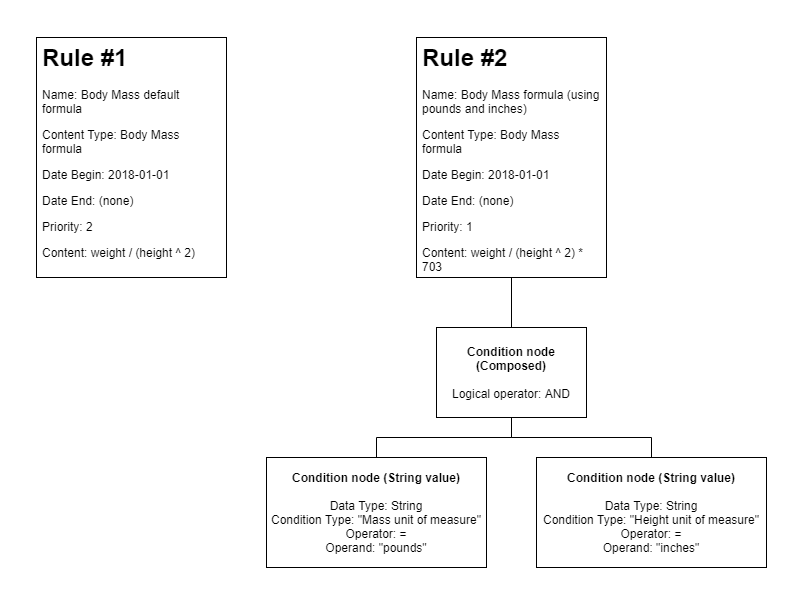

# Rules Framework

Rules.Framework is a generic rules framework that allows defining and evaluating rules for complex business scenarios.

Why use rules? Most of us at some point, while developing software to support a business, have come across fast paced business logic changes. Sometimes, business needs change overnight, which requires a fast response to changes by engineering teams. By using rules, changing a calculus formula, a value mapping or simply a toggle configuration no longer requires code changes/endless CI/CD pipelines, QA validation, and so on... Business logic changes can be offloaded to configuration scenarios, instead of development scenarios.

## Packages

|Name                             |nuget.org|fuget.org|
|---------------------------------|----|---------|
|Rules.Framework|||
|Rules.Framework.Providers.MongoDb|||
|Rules.Framework.Providers.InMemory|||

## Features

The following listing presents features implemented and features to be implemented:

- [x] Rules evaluation (match one)
- [x] Rules evaluation (match many)
- [x] Rules search
- [x] Rules content serializarion
- [ ] Rules data source caching
- [x] Rules management (Create, Read, Update)
- [X] In-memory data source support
- [x] MongoDB data source support
- [ ] SQL Server data source support

## How it works

Starting with the basics, what are we considering a rule?

> A rule is a data structure limited in time (**date begin and date end**) which is categorized by a **content type**. It's match on scenario is constrained by **conditions** which are used to determine if it is applicable, and also defines a **priority** as untie criteria when multiple rules have a match. A rule contains its **content** to be used on a specific business scenario.

For Rules.Framework, a valid rule accounts for the following conditions:

- Categorized by a **content type**, which groups rules by those that will be evaluated together. Rules from different content types won't be evaluated together. Content type is a user defined type, which can be a value type or a object, depending on the requirements of usage.
- Has a **name**, which must be unique by content type.
- Is constrained in time by a **date begin** and a **date end**. Date begin must be always set, and date end can be null (meaning that rule is applied from date begin to _ad eternum_). Please note that date begin threshold is inclusive and date end threshold is exclusive, so if you define a rule with date begin as "2020-01-01" and date end as "2021-01-01", if evaluation date is set to "2020-01-01", rule will match, but if evaluation date is set to "2021-01-01", rule will not match.
- Has a **priority** numeric value, which works as tiebreaker when many rules match on rules interval and given input conditions. Rules.Framework has the ability to configure if tiebreaker criteria is set to highest priority value or lowest priority value. This value must always be positive.
- Also has a set of **conditions** disposed in tree. Conditions can be set combined by AND/OR operators and by using comparison operators to compare values set on rule (integer, boolean, string or decimal) to input conditions. Conditions are categorized by a condition type, which must be one of the user-defined types (either value types or objects).
- And a **content** defined by user and totally up to the user to validate it (can virtually be anything the user wants, as long as the persistence mechanism used as data source supports it).

Bellow you can see a simple sample for demonstration purposes:

The sample rule presented:

- Is described by it's name as "Body Mass default formula" - a simple human-readable description.
- Has a content type "Body Mass formula" that categorizes it.
- Begins at 1st January 2018 and never ends - which means that requesting on a date before 1st January 2018, rule is not matched, but after midnight at the same date, the rule will match.
- Priority is set to 1. This would be used as tiebreaker criteria if there were more rules defined, but since there's only one rule, there's no difference on evaluation.
- Rule has no conditions defined - which means, requesting on a date on rule dates range, it will always match.

Simple right? You got the basics covered, let's complicate this a bit by adding a new rule. The formula you saw on the first rule is used to calculate body mass when using kilograms and meters unit of measures, but what if we wanted to calculate using pounds and inches? Let's define a new rule for this:

Newly defined rule (Rule #2):

- Becomes the rule with priority 1.
- Defines a new formula.
- Defines a composed condition node specifying that a AND logical operator must be applied between child nodes conditions results.
- Defines a condition node with data type string, having a condition type of "Mass unit of measure", operator equal and operand "pounds".
- Defines a second condition node with data type string, having a condition type of "Height unit of measure", operator equal and operand "inches".

If you request a rule for the content type "Body Mass formula" by specifying date 2019-01-01, "Mass unit of measure" as "pounds" and "Height unit of measure" as "inches", both rules will match (remember that Rule #1 has no conditions, so it matches anything). At this point is where priority is used to select the right one (by default, lowest priority values win to highest values, but this is configurable), so Rule #2 is chosen.

> Remember, when you are defining rules, there are several ways on which you can define rules to match your logic needs. There's simply no silver bullet. If you need to have always a rule match, you need to find a default rule - one that matches on every scenario - and do define it, to ensure you always get a response.

## Using the framework

1. [Getting started](docs/getting-started.md)
2. [Add rules](docs/add-rules.md)
3. [In-memory data source provider](docs/using-in-memory-data-source.md)
4. [MongoDB data source provider](docs/using-mongo-db-data-source.md)
5. [New data source provider - how to](docs/new-data-source-how-to.md)

## Contributing

Contributions are more than welcome! Submit comments, issues or pull requests, I promise to keep an eye on them :)

Head over to [CONTRIBUTING](CONTRIBUTING.md) for further details.

While I try to do the best I can, suggestions/contributions are deeply appreciated on documentation!
