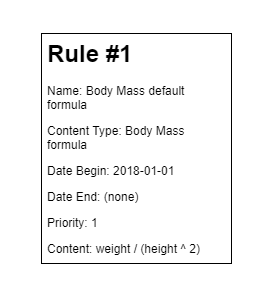
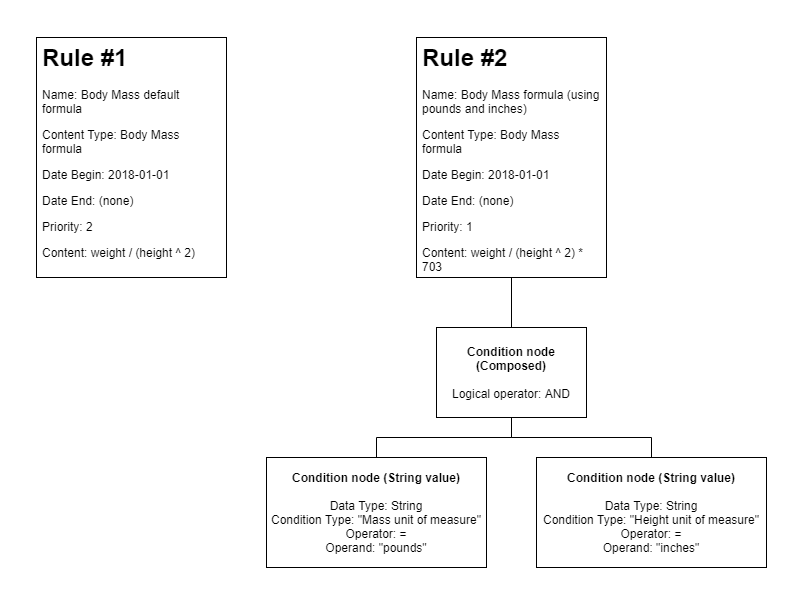

# Rules Framework

Rules.Framework is a generic rules framework that allows defining and evaluating rules for complex business scenarios.

Why use rules? Most of us at some point, while developing software to support a business, have come across fast paced business logic changes. Sometimes, business needs changes overnight, which requires a fast response to changes by engineering teams. By using rules, changing a calculus formula or a value mapping no longer requires code changes/endless CI/CD pipelines, QA validation, and so on... Business logic changes can be offloaded to configuration scenarios, instead of development scenarios.

[](https://ci.appveyor.com/project/pikenikes/rules-framework/branch/master)
[](https://sonarcloud.io/dashboard?id=pikenikes_rules-framework)
[](https://www.nuget.org/packages/Rules.Framework/)

## Features

The following listing presents features implemented and features to be implemented:

[x] Rules evaluation (match one)
[ ] Rules evaluation (match many)
[ ] Rules search
[x] Rules content serializarion
[ ] Rules data source caching
[ ] Rules management (Create, Read, Update)
[ ] MongoDB data source support

## How it works

First, let's start with the basics: what are we considering a rule?

> A rule is a data structure limited in time (**date begin and date end**) which is categorized by a **content type**. It's application is constrained by **conditions** which are used to determine if it is applicable to a scenario, and also defines a **priority** as untie criteria when multiple rules match. A rule contains a **content** to be used on specific business scenario.

Confusing at first glimpse, right? Let's review the simplest sample for demonstration purposes:



The sample rule presented:

* Is described by it's name as "Body Mass default formula" - a simple human-readable description.
* Has a content type "Body Mass formula" that categorizes it. This categorization is used as means to group rules during evaluation so they are evaluated together.
* Begins at 1st January 2018 and never ends - which means that requesting on a date before 1st January 2018, rule is not matched, but after midnight at the same date, the rule will match.
* Priority is set to 1. This would be used as untie criteria if there were more rules defined, but since there's only one rule, there's no difference on evaluation.
* Rule has no conditions defined - which means, requesting on a date on rule dates range, it will always match.

Simple right? You got the basics covered, let's complicate this a bit by adding a new rule. The formula you saw on the first rule is used to calculate body mass when using kilograms and meters unit of measures, but what if we wanted to calculate using pounds and inches? Let's define a new rule for this:



Newly defined rule (Rule #2):

* Becomes the rule with priority 1.
* Defines a new formula.
* Defines a composed condition node specifying that a AND logical operator must be applied between child nodes conditions results.
* Defines a condition node with data type string, having a condition type of "Mass unit of measure", operator equal and operand "pounds".
* Defines a second condition node with data type string, having a condition type of "Height unit of measure", operator equal and operand "inches".

If you request a rule for the content type "Body Mass formula" by specifying date 2019-01-01, "Mass unit of measure" as "pounds" and "Height unit of measure" as "inches", both rules will match (remember that Rule #1 has no conditions, so it matches anything). At this point is where priority is used to untie this (by default, lowest priority values win to highest values, but this is configurable), so Rule #2 is chosen.

> Remember, when you are defining rules, there are several ways on which you can define rules to match your logic needs. There's simply no silver bullet. If you need to have always a rule match, you need to find a default rule - one that matches on every scenario - and do define it, to ensure you always get a response.

## Using the framework

So, how do you use the framework to have rules evaluated? Let's see how...

1. Define your content types (suggestion: use an enum).

```csharp
internal enum ContentTypes
{
    BodyMassIndexFormula = 1
}
```

2. Define your condition types (suggestion: use an enum).

```csharp
internal enum ConditionTypes
{
    MassUnitOfMeasure = 1,
    HeightUnitOfMeasure = 2
}
```

3. Have a rules data source set up (e.g. a database). NOTE: you will have to implement your data source for the time being. There's plans to support MongoDB in the future.

```csharp
public interface IRulesDataSource<TContentType, TConditionType>
{
    Task<IEnumerable<Rule<TContentType, TConditionType>>> GetRulesAsync(TContentType contentType, DateTime dateBegin, DateTime dateEnd);
}
```

You'll have to map each condition type defined by you to a data type on your rules data source. The ones available are:

* Integer
* Decimal
* String
* Boolean

For your guidance, check sample rules load from file: [RulesFromJsonFile.cs](tests/Rules.Framework.IntegrationTests/RulesFromJsonFile.cs)

4. Build a rules engine.

```csharp
RulesEngineBuilder rulesEngineBuilder = new RulesEngineBuilder();

RulesEngine<ContentTypes, ConditionTypes> rulesEngine = rulesEngineBuilder.CreateRulesEngine()
    .WithContentType<ContentTypes>() // Your content types.
    .WithConditionType<ConditionTypes>() // Your condition types.
    .SetDataSource(rulesDataSource) // A rules data source instance implemented by you.
    .Build();
```

5. Evalutate rule match.

```csharp
Condition<ConditionTypes>[] expectedConditions = new Condition<ConditionTypes>[]
{
    new Condition<ConditionTypes>
    {
        Type = ConditionTypes.MassUnitOfMeasure,
        Value = "pounds"
    },
    new Condition<ConditionTypes>
    {
        Type = ConditionTypes.HeightUnitOfMeasure,
        Value = "inches"
    }
};

Rule<ContentTypes, ConditionTypes> ruleMatch = await rulesEngine.MatchOneAsync(ContentTypes.BodyMassIndexFormula, new DateTime(2019, 1, 1), conditions);
```

## Contributing

Contributions are more than welcome! Submit comments, issues or pull requests, I promise to an eye on them :)

While I try to do the best I can, suggestions/contributions are deeply appreciated on documentation!
