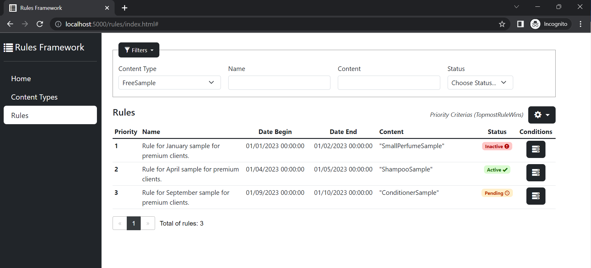

# Rules Framework

Rules.Framework is a generic framework that allows defining and evaluating rules for complex business scenarios.

[](https://app.codacy.com/gh/Farfetch/rules-framework?utm_source=github.com&utm_medium=referral&utm_content=Farfetch/rules-framework&utm_campaign=Badge_Grade_Settings)
[](https://github.com/luispfgarces/rules-framework/actions/workflows/dotnet-build.yml)

## What is a rule?

A rule is a data structure limited in time (`date begin` and `date end`), whose content is categorized by a `content type`. Its applicability is constrained by `conditions`, and a `priority` value is used as untie criteria when there are multiple rules applicable.

## Why use rules?

By using rules, we're able to abstract a multiplicity of business scenarios through rules configurations, instead of heavy code developments. Rules enable a fast response to change and a better control of the business logic by the product owners.

## Packages

|Name                             |nuget.org|downloads|fuget.org|
|---------------------------------|----|---------|-----|
|[Rules.Framework](#rulesframework)|[](https://www.nuget.org/packages/Rules.Framework/)|[](https://www.nuget.org/packages/Rules.Framework/)|[](https://www.fuget.org/packages/Rules.Framework)
|[Rules.Framework.Providers.MongoDB](#rulesframeworkprovidersmongodb)|[](https://www.nuget.org/packages/Rules.Framework.Providers.MongoDB/)|[](https://www.nuget.org/packages/Rules.Framework.Providers.MongoDB/)|[](https://www.fuget.org/packages/Rules.Framework.Providers.MongoDB)
|[Rules.Framework.WebUI](#rulesframeworkwebui)|[](https://www.nuget.org/packages/Rules.Framework.WebUI/)|[](https://www.nuget.org/packages/Rules.Framework.WebUI/)|[](https://www.fuget.org/packages/Rules.Framework.WebUI)

## Rules.Framework
[](https://www.nuget.org/packages/Rules.Framework/)

The Rules.Framework package contains the core of the rules engine. It includes an in-memory provider for the rules data source.

### Basic usage

To set up a `RulesEngine`, define the content types and condition types to be used.

```csharp
enum ContentType { FreeSample = 1, ShippingCost = 2 }
enum ConditionType { ClientType = 1, Country = 2 }
```

Build the engine with the `RulesEngineBuilder`.

```csharp
var rulesEngine = RulesEngineBuilder.CreateRulesEngine()
    .WithContentType<ContentType>()
    .WithConditionType<ConditionType>()
    .SetInMemoryDataSource()
    .Configure(c => c.PriorityCriteria = PriorityCriterias.BottommostRuleWins)
    .Build();
```
Use the `RuleBuilder` to assemble a rule.

```csharp
var ruleForPremiumFreeSample = RuleBuilder
    .NewRule<ContentType, ConditionType>()
    .WithName("Rule for perfume sample for premium clients.")
    .WithContent(ContentType.FreeSample, "SmallPerfumeSample")
    .WithCondition(c => c
        .AsValued(ConditionType.ClientType)
        .OfDataType<string>()
        .WithComparisonOperator(Operators.Equal)
        .SetOperand("Premium")
        .Build())
    .WithDateBegin(new DateTime(2020, 01, 01))
    .Build();
```

Add a rule to the engine with the `AddRuleAsync()`.

```csharp
rulesEngine.AddRuleAsync(ruleForPremiumFreeSample.Rule, RuleAddPriorityOption.ByPriorityNumber(1));
```

Get a matching rule by using the `MatchOneAsync()` and passing a date and conditions.

```csharp
var matchingRule = rulesEngine.MatchOneAsync(
        ContentType.FreeSample, 
        new DateTime(2021, 12, 25), 
        new[]
        {
            new Condition<ConditionType>() { Type = ConditionType.ClientType, Value = "Premium" }
        });
```

### Complex scenarios

To understand how the Rules.Framework can be used in various business scenarios, please check the [Wiki](https://github.com/Farfetch/rules-framework/wiki). 

Check also the test scenarios and samples available within the source-code.

## Rules.Framework.Providers.MongoDB
[](https://www.nuget.org/packages/Rules.Framework.Providers.MongoDb/)

To keep rules persisted in a MongoDB database, use the extension method in the Providers.MongoDB package to pass your MongoClient and MongoDbProviderSettings to the `RulesEngineBuilder`.

```csharp
var rulesEngine = RulesEngineBuilder.CreateRulesEngine()
    .SetInMongoDBDataSource(mongoClient, mongoDbProviderSettings)
```

## Rules.Framework.WebUI
[](https://www.nuget.org/packages/Rules.Framework.WebUI/)

The WebUI package offers a way of visualizing the rules in your web service. To configure the UI, pass the rules engine as generic to the `IApplicationBuilder` extension method provided.

```csharp
app.UseRulesFrameworkWebUI(rulesEngine.CreateGenericEngine());
```

Access is done via the endpoint `{host}/rules/index.html`.



## Features

The following list presents features already available and others projected:
- [x] Rules evaluation (match one)
- [x] Rules evaluation (match many)
- [x] Rules content serialization
- [x] Rules management (Create, Read, Update)
- [x] In-memory data source support
- [x] MongoDB data source support
- [ ] SQL Server data source support
- [ ] Rules data source caching
- [x] Rules data source compilation
- [x] WebUI for rules visualization

## Documentation

See the [Wiki](https://github.com/Farfetch/rules-framework/wiki) for full documentation, short examples and other information.

## Contributing

Contributions are more than welcome! Submit comments, issues or pull requests, we promise to keep an eye on them :)

Head over to [CONTRIBUTING](CONTRIBUTING.md) for further details.

## License

[MIT License](LICENSE.md)